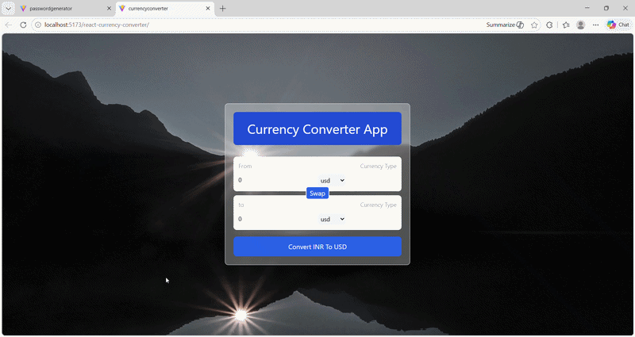
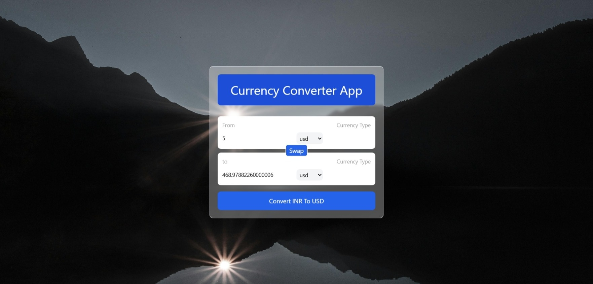
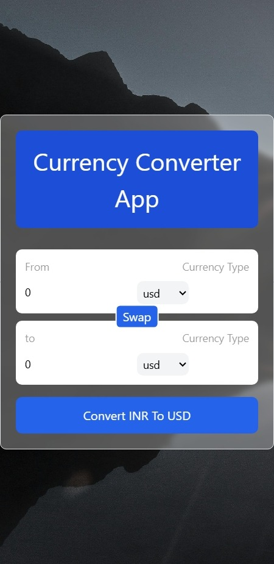

# 💱 React Currency Converter


A modern and responsive **Currency Converter Web Application** built using **React**, enabling users to convert currencies in real-time using live exchange rates from an external API.

---

## 🚀 Live Demo

🌐 **Live App:** https://khushi-66.github.io/react-currency-converter/

📂 **GitHub Repository:** https://github.com/khushi-66/react-currency-converter

---

## 🎥 Live Preview



---

## 📌 Overview

This project demonstrates real-world implementation of **API integration** and **dynamic state management** in React.

It showcases:

* Fetching live exchange rates from an external API
* Managing asynchronous data using React Hooks
* Real-time UI updates based on user input
* Clean and responsive interface design

---

## 🧠 Key Learnings

* Handling API calls using `fetch` / async logic
* Managing state using `useState`
* Handling side effects using `useEffect`
* Building reusable components
* Working with dynamic data rendering

---

## 📸 Screenshots

### 🏠 Home Interface


### 💱 Currency Conversion



### 🔽 Currency Dropdown


### 📱 Mobile View



---

## ✨ Features

* 🌍 Real-time currency conversion
* 🔄 Swap currencies instantly
* ⚡ Fast and responsive UI
* 🔢 Accurate exchange rates via API
* 📱 Mobile-friendly design
* 🎯 Clean and intuitive interface

---

## ⚡ Performance & Optimization

* Optimized API calls using efficient state updates
* Minimal re-renders using proper state handling
* Lightweight and fast UI rendering
* Smooth user experience with instant updates

---

## 🛠️ Tech Stack

| Technology            | Usage          |
| --------------------- | -------------- |
| **React.js**          | Frontend       |
| **JavaScript (ES6+)** | Logic          |
| **CSS / Tailwind**    | Styling        |
| **Currency API**      | Exchange rates |
| **Vite**              | Build tool     |

---

## 🌐 Deployment

This project is deployed using **GitHub Pages**, making it publicly accessible worldwide.

### 🚀 Deployment Process:

* Built the React app for production
* Configured deployment via GitHub Pages
* Hosted directly from the repository
* Generated a live public URL

---

## 📂 Project Structure

```bash
react-currency-converter/
│── public/
│── src/
│   ├── components/
│   ├── hooks/
│   ├── App.jsx
│   └── main.jsx
│── screenshots/
│── assets/
│── package.json
│── README.md
```

---

## ⚙️ Installation & Setup

```bash
git clone https://github.com/khushi-66/react-currency-converter.git
cd react-currency-converter
npm install
npm run dev
```

---

## 📈 Future Improvements

* 📊 Currency trends & charts
* ⭐ Favorite currencies
* 🌐 Multi-language support
* 💾 Save last selected currencies
* 🔔 Rate alerts

---

## 👩‍💻 Author

**Khushi Sahu**
🔗 https://github.com/khushi-66

---

## ⭐ Support

If you like this project, give it a ⭐ on GitHub!
