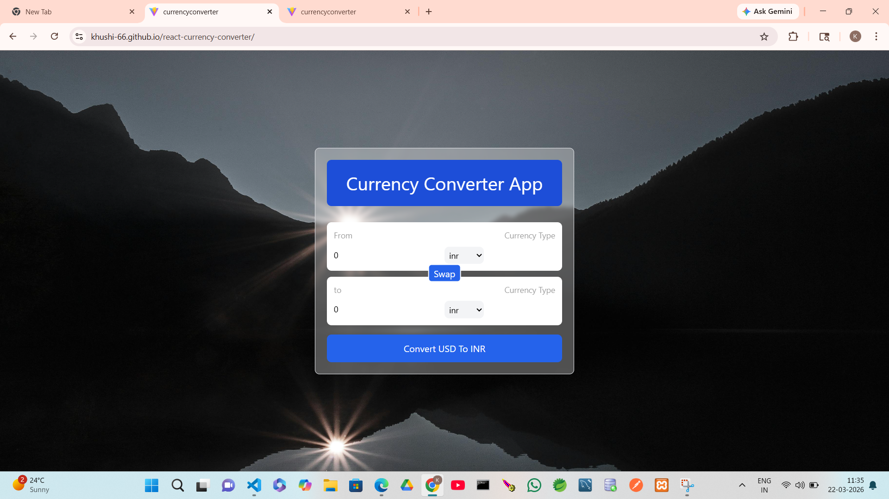

# 💱 React Currency Converter

A simple and responsive **Currency Converter Web App** built using React. This application allows users to convert currencies in real-time using live exchange rates.

---

## 🚀 Live Demo

🔗 https://khushi-66.github.io/react-currency-converter/
---

## 📸 Screenshots

### 🔹 Home Page



### 🔹 Currency Conversion


### 🔹 Currency Dropdown


### 🔹 Mobile View 


---

## ✨ Features

* 🌍 Real-time currency conversion
* 🔄 Swap currencies easily
* ⚡ Fast and responsive UI
* 📱 Mobile-friendly design
* 🔢 Accurate exchange rates using API

---

## 🛠️ Tech Stack

* **Frontend:** React.js
* **Styling:** CSS / Tailwind 
* **API:** Currency Exchange API
* **Build Tool:** Vite 

---

## 📂 Project Structure

```
react-currency-converter/
│── public/
│── src/
│   ├── components/
│   ├── hooks/
│   ├── App.jsx
│   └── main.jsx
│── screenshots/        # Screenshots folder
│── package.json
│── assests/
│── README.md
```

---

## ⚙️ Installation & Setup

1. Clone the repository

```bash
git clone https://github.com/khushi-66/react-currency-converter.git
```

2. Navigate to project folder

```bash
cd react-currency-converter
```

3. Install dependencies

```bash
npm install
```

4. Run the app

```bash
npm run dev
```

---

## 🔌 API Integration

This project uses a currency exchange API to fetch real-time data.

Example:

```js
fetch(`[https://latest.currency-api.pages.dev/v1/currencies/usd.json]`)
```

---

## 📌 Future Improvements

* 📊 Add historical data charts
* ⭐ Favorite currencies
* 🌐 Multi-language support
* 💾 Save last used currencies

---

## 🤝 Contributing

Contributions are welcome! Feel free to fork this repo and submit a pull request.

---

## 📜 License

This project is licensed under the MIT License.

---

## 👩‍💻 Author

**Khushi Sahu**
🔗 GitHub: https://github.com/khushi-66

---

⭐ If you like this project, don’t forget to star the repo!
